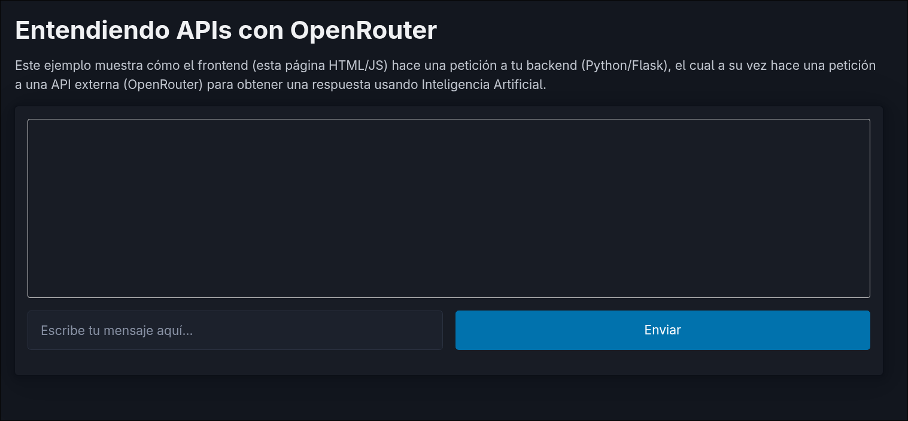

# 🚀 Ejemplo Básico de API (Python, HTML/JS, OpenRouter)


Este es un proyecto educativo minimalista diseñado para entender el flujo de comunicación cliente-servidor cuando se integran APIs externas de Inteligencia Artificial (en este caso, **OpenRouter**).



## 💡 Flujo de Comunicación

El proyecto demuestra por qué el **Backend** debe ser el responsable de comunicarse con la API de IA, evitando que las llaves secretas se expongan en el código del navegador:

1. **Frontend (Navegador, HTML/JS):** El usuario escribe un mensaje y hace clic en Enviar. JavaScript captura este texto y hace una petición `POST` local hacia `/api/chat`.
2. **Backend (Python, Flask):** Actúa como un intermediario seguro. Recibe el texto, le adjunta tu `API_KEY` (tu contraseña) oculta, y hace una **nueva** petición HTTP hacia OpenRouter.
3. **API Externa (OpenRouter):** Procesa el mensaje usando un modelo IA (`mistralai/mistral-7b-instruct:free`) y retorna la respuesta.
4. **Respuesta final:** El backend filtra el JSON y devuelve el texto puro al frontend.

---

## 🛠️ Cómo ejecutar el proyecto (Paso a Paso)

### 1. Preparar el Entorno Virtual de Python
> **Importante para Linux (Arch/Ubuntu):** Si usas la terminal y obtienes el error `externally-managed-environment` (PEP 668), es obligatorio crear y activar un entorno virtual **antes** de usar `pip`.

Abre la terminal en la carpeta del proyecto y ejecuta:

```bash
# Crear el entorno virtual (solo se hace una vez)
python -m venv .venv

# ACTIVAR el entorno virtual (muy importante hacerlo antes de instalar)
source .venv/bin/activate    # En Linux / macOS
# .venv\Scripts\activate     # En Windows
```
*(Nota: Cuando estés en el entorno virtual, tu terminal debe mostrar `(.venv)` al principio de la línea).*

### 2. Instalar las Dependencias
Con el entorno virtual activado, instala Flask y Requests:
```bash
pip install -r requirements.txt
```

### 3. Configurar tu llave de OpenRouter
1. Ve a [OpenRouter Keys](https://openrouter.ai/keys) y crea tu cuenta gratuita.
2. Genera una API Key.
3. En la carpeta del proyecto, crea un archivo llamado `.env` basándote en el archivo de ejemplo:
   ```bash
   cp .env.example .env
   ```
4. Edita `.env` y pega tu llave real:
   ```env
   OPENROUTER_API_KEY=sk-or-v1-xxxxxxxx...
   ```

### 4. Lanzar el Servidor y Probar
Finalmente, ejecuta el backend (recuerda tener `.venv` activado):
```bash
python app.py
```
Abre tu navegador y entra a **[http://127.0.0.1:5000/](http://127.0.0.1:5000/)**. ¡Escribe algo y mira cómo responde la IA!
